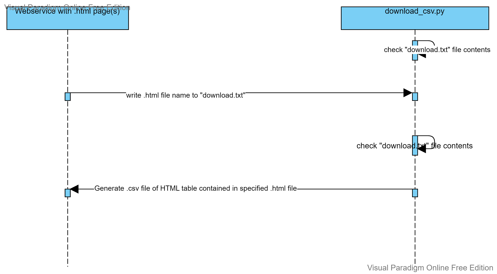

# HTML to CSV
 Convert an HTML table to a CSV file

A. How to REQUEST data from the microservice.
    
    First, ensure that the BeautifulSoup and Pandas modules of Python are installed with:
        pip install beautifulsoup4
        pip install pandas
    
    In order to request data from the microservice, the microservice should be running concurrently with a given
    website. Then, the name of a .html file that includes an HTML table contained in the same directory as the 
    microservice and/or availble to the microservice must be written to the "download.txt" file. This causes the micro-
    service to run its conversion function.

    For example, there is a website with multiple .html pages (e.g., homepage.html, movies.html, etc.). When the website
    is launched, the "download.txt" file starts out blank. When a user toggles an interface element (e.g., download
    button), the name of the .html page with the table to be downloaded (e.g., "movies.html") is written to the
    "download.txt" file. This initiates the conversion. The "download.txt" file is then wiped for the next download
    attempt.

B. How to RECEIVE data from the microservice.
    
    Once the "download.txt" file contains the .html file name, the microservice generates a .csv file of the HTML table
    contained in the specified .html file. This .csv file is then stored in the same directory as the microservice, by 
    default, to be passed to the user through the browser.

C.  UML sequence diagram showing how requesting and receiving data work.

